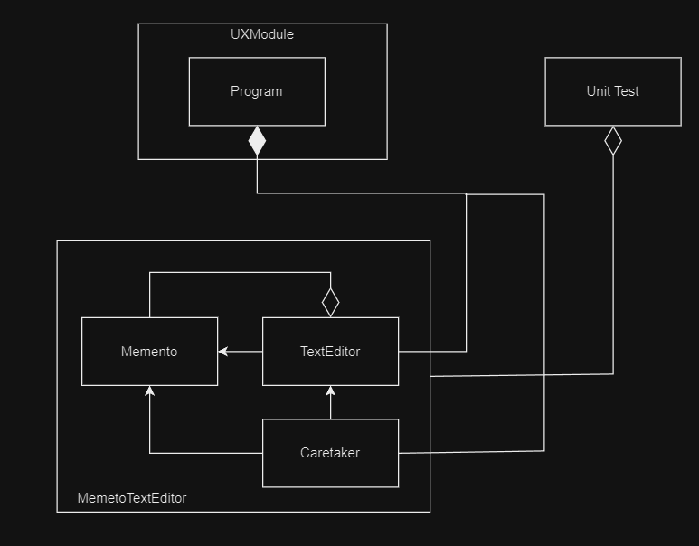

# Brief Overview
### Software Design Patterns
In software engineering, design patterns are general, repeatable solutions to common problems encountered in software design. They embody best practices utilized by skilled object-oriented developers. Essentially, design patterns are reusable templates that help developers address recurring issues in software design. They offer a structured method, enhancing the ability to adapt to specific design challenges.

#### Behavioural Design Patterns
Behavioral design patterns focus on defining interactions between objects. Examples include the strategy pattern, the template method pattern, and the state pattern. These patterns are commonly used to encapsulate logic, improve code flexibility, and enable behavior changes without modifying the underlying code.

# Memento Design Pattern
Memento is a behavioral design pattern that lets you save and restore the previous state of an object without revealing the details of its implementation.
Real-world examples:
- GUI editor (e.g. MS Paint)
- Drawing Applications
- Video Games progress state management

## The Memento Design Pattern consists of the following components

### 1. Originator
This is the object whose state you want to save and restore.
### 2. Memento
This object stores the state of the Originator.
### 3. Caretaker
This object is responsible for storing and restoring Memento objects. It keeps a history of the states so the user can undo or redo their changes.

## About the project
The following project is a simple Text Editor that displays the most recent text entered by the user, the user can undo (to get back to the previous state if exists) or redo (to get the next state if exists).
- TextEditor: This is the originator class
- Memento: Stores the state of TextEditor
- HistoryCaretaker: Keeps history of the states

## Class and Module Diagram

## Coverage Report
A coverage report using [reportgenerator](https://reportgenerator.io/getstarted)

[Coverage_report](https://gr1310.github.io/MementoDesignPattern/)
The report verifies 100% code coverage for non-UX modules.
# Environment
The project builds and runs with Visual Studio Community 2022 when the required workloads are installed.
